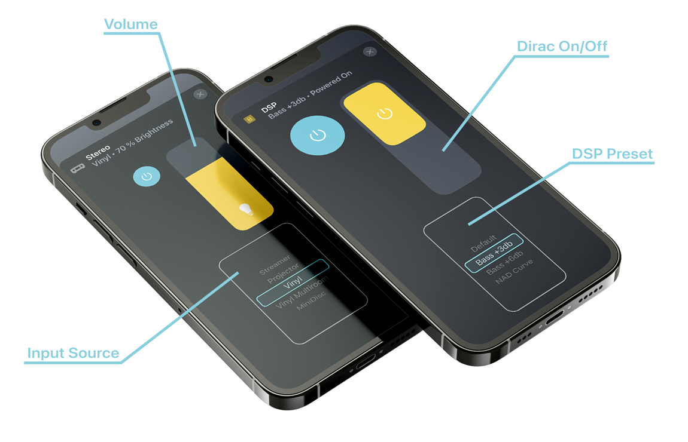

# Control your miniDSP Flex from your iPhone

[miniDSP Flex](https://www.minidsp.com/products/minidsp-in-a-box/flex) is a versatile audio processor that can be used as a preamplifier, digital-to-analog converter (DAC) and digital signal processor (EQ, [Dirac room correction](https://www.dirac.com)).

This Homebridge plugin allows you to change the volume, input source, DSP preset and Dirac status right from your iPhone, iPad, Mac and Apple  Watch. 

## Features

* **Absolute volume control:** Quickly pick any volume between 0% and 100% 
* **Custom names for each input source:** *Vinyl* is so much easier to understand than *Analog Input*
* **Individual gain per input source:** You don't have to re-adjust the volume when changing between inputs 
* **DSP preset selection including custom naming:** *Bass +3db* is much easier to remember than *Preset 2*
* **Dirac on and off control:** A/B-testing right from your couch

## Architecture

iDevice -> HomeKit
Homebridge with this plugin -> REST
miniDSP-RS -> USB
miniDSP Flex

## Setup

* [Install miniDSP RS](https://github.com/mrene/minidsp-rs/releases) on a machine connected to your miniDSP Flex
* Run miniDSP RS, e.g. type `minidspd.exe -v` in the Windows Command Prompt
* Install this plugin in Homebridge by just searching for `homebridge-minidsp-rs` in the Plugins tab
* Configure this plugin using [config.sample.json](config.sample.json) as a template
  * Set `miniDSPServerURL` to the IP of the machine running miniDSP RS, e.g. `http://192.168.178.123:5380`
  * Change `name` and `dspName` to your liking. This will be how the both screens will be named in your Home App
  * If you are using Dirac, add at least [10db headroom](https://support.minidsp.com/support/solutions/articles/47000681666-why-do-i-get-distortion-when-i-turn-on-dirac-live-), i.e. just keep `maximumDSPVolume` set to `-10`
  * Under `inputs` remove the inputs you don't need and for the remaining, change the `displayName` and `gain` to your liking
  * Under `presets` remove the presets you don't need and for the remaining, change the `displayName` to your liking

## Notes

* This plugin accepts changes even if the miniDSP is not reachable (e.g. when it is still powering up) and applies them as soon as it is available again.
* This plugin assumes it is in charge, meaning any changes done directly on the miniDSP or via the infrared control will be overriden (eventually)
* The volume level slider is called `Brightness` due to limitations in Apple HomeKit. I hope one day Apple allows for more custom user interfaces

## Thanks

[miniDSP RS](https://github.com/mrene/minidsp-rs) for making miniDSP easy to control via API
